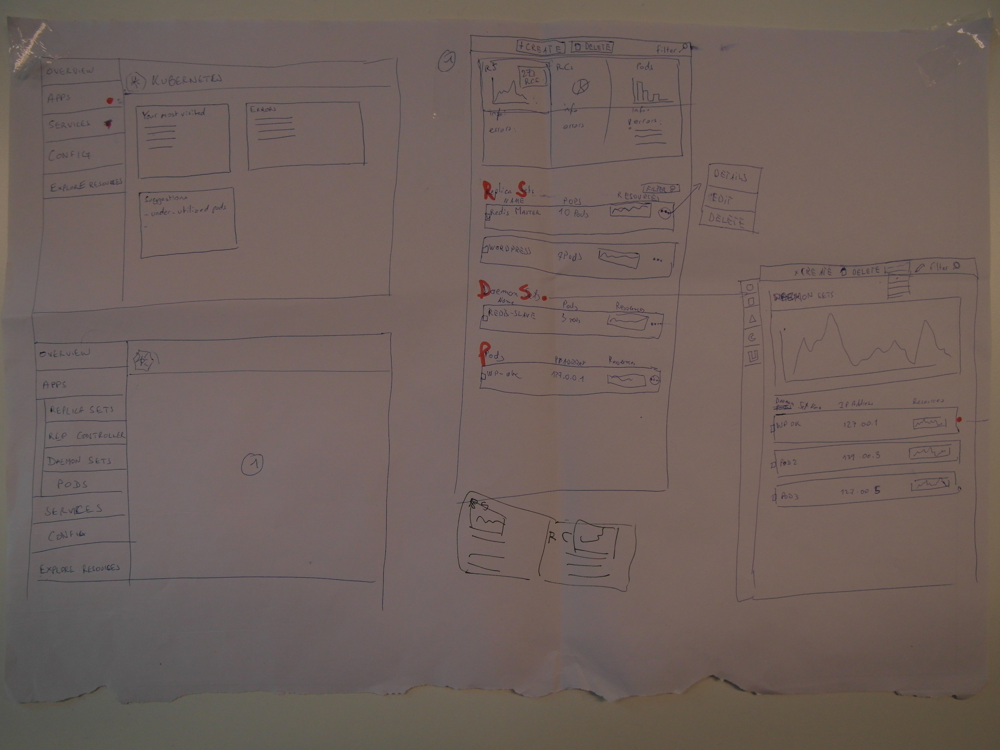
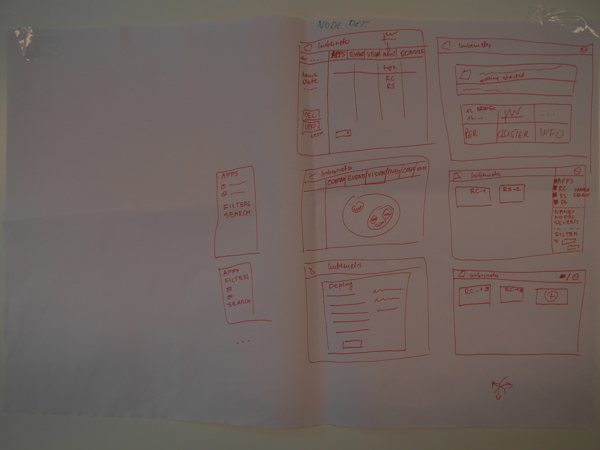

# Kubernetes Dashboard Design Sprint (Łódź, Poland, 23 Mar 2016)

## People
@bryk, @cheld, @digitalfishpond, @floreks, @maciaszczykm, @olekzabl, @zreigz

## Goals
Sketch the directions of the development of the UI to achieve:
* scalability for the variety of types of K8s objects we want to handle
(currently: replication controllers & pods;
desired: replica sets, daemon sets, container, nodes, volumes, secrets, deployments etc.)
* scalability for the number of such objects
(currently: cards are suitable for <20 objects; desired: show >100 pods in a nice way)
* good UX for various use cases
(monitor, debug, deploy, explore)
* more aware about namespaces

## Agenda
* agree on the meeting’s goals
* split into 3 groups - propose a general UX vision - discuss them together, unify
* split again - sketch the system in more detail - discuss, unify
* split once more - sketch a chosen page, in yet more detail - discuss
* decide when and how to publish the results

## Decisions

### General navigation
* constant, basic-purpose navigation menu on the left, containing:
  - items describing important _classes_ (coarser than _types_) of objects e.g. “apps”, “services”, “config”
  - under them, sub-items describing _types_ of objects
  - possibly, other special buttons, e.g. “resource explorer”
  - possibly, minimizable

* context-dependent action bar on the top (below the main “K8s” bar)
  - buttons for basic actions, e.g. “create”, “edit”, “delete”

* namespace switcher on the main “K8s” bar
  - single namespace / all namespaces / multi-choice / filter
  - shall it be visible also on the object details page?

### Cards
* will be generally replaced by table rows
* possibly thicker to contain few more data items and/or some graphs
* much more clear sorting; sort triggered by clicking on column name
* easier pagination

### Home page
* does no more list all objects (or RCs) in the cluster
* instead, it shows:
  - important messages (errors/warnings/suggestions)
  - a few selected objects (last visited/most visited/most important)

### Details page of an object
* general requirements:
  - has possibly (but reasonably) unique design across various object types
  - allows convenient navigation to all _directly related_ objects;
by this we mean e.g. that a pod shows links to all volumes it uses, and conversely, a volume shows links to all pods using it
  - contains a number of sections (described below); 
some of them may be moved to other tabs if everything does not fit in one page
(e.g. we will need several tabs for RCs, but not for secrets)

* section (main tab): a brief description of the object status
  - for a simple object, this contains all its properties
  - for a more complex one, this contains most important properties, while all properties are gathered in another tab of the page

* section (main tab): visual summaries for all directly related objects (aggregated by type)
  - example: for a RC, these could be activity graphs of all involved pods, volumes, services etc.

* section (main tab, bottom): navigation links to directly related objects
  - grouped by type 
  - each type is headed by a user-friendly description of type, and of the relation to the current object (e.g. '_volumes mounted to_ this pod', '_pods mounting_ this volume', etc.)
  - limited to e.g. 10 top items, to make them all fit in one page
(this has the form of a table, so clicking column names allows adjusting the meaning of “top”)
  - if there are more related objects of some type, we provide a link to the list of all of them (see below)

* other sections (main or additional tab): history, logs, (more?)

### Summary page for objects of type X
* can be:
  - global (with namespace restriction applied), reachable by left menu panel
  - scoped (all objects of type X related to object O), reachable from O details page
* similar visual design to the object details page
* upper section: general metrics of involved objects
* lower section: list of all involved objects, tabularized

### Supplementary ideas, questions etc.
* resource explorer
  - goal: give a larger-scale insight into cluster structure (beyond “directly related” links)
  - shall easily support filtering
  - two considered views: 
    - “filebrowser view”: very compact but difficult to model all relations in a cluster
  (a volume may have many pods mounting it as “parents”; network communication between pods is not at all a “parent-child-sibling” relation)
    - “graph visualization”
  - in any view, exploring may be enhanced by showing an additional details preview side-by-side

* error messaging policy
On the details page of a RC, do we want to show that 3 out of 100 its volumes are broken?
Is this important enough? Generally, what is sufficiently important? How do we decide on this?

## Images

